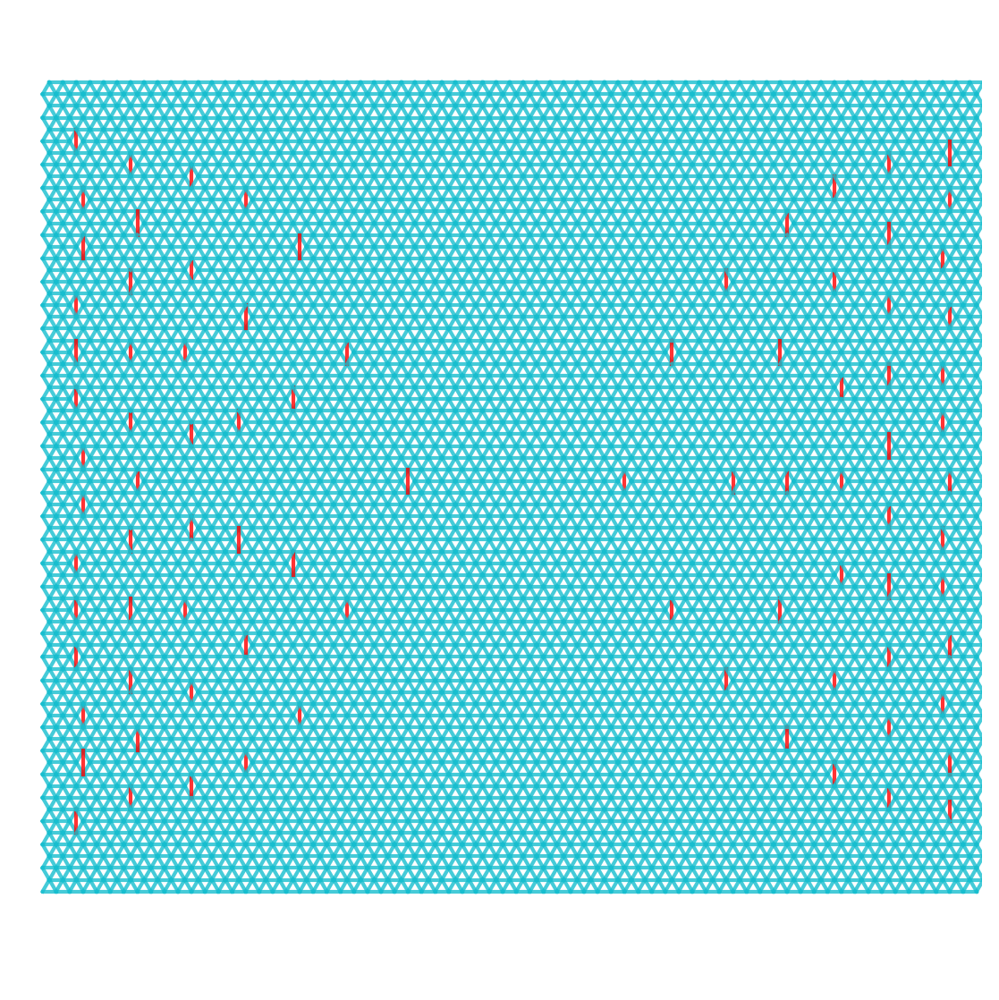
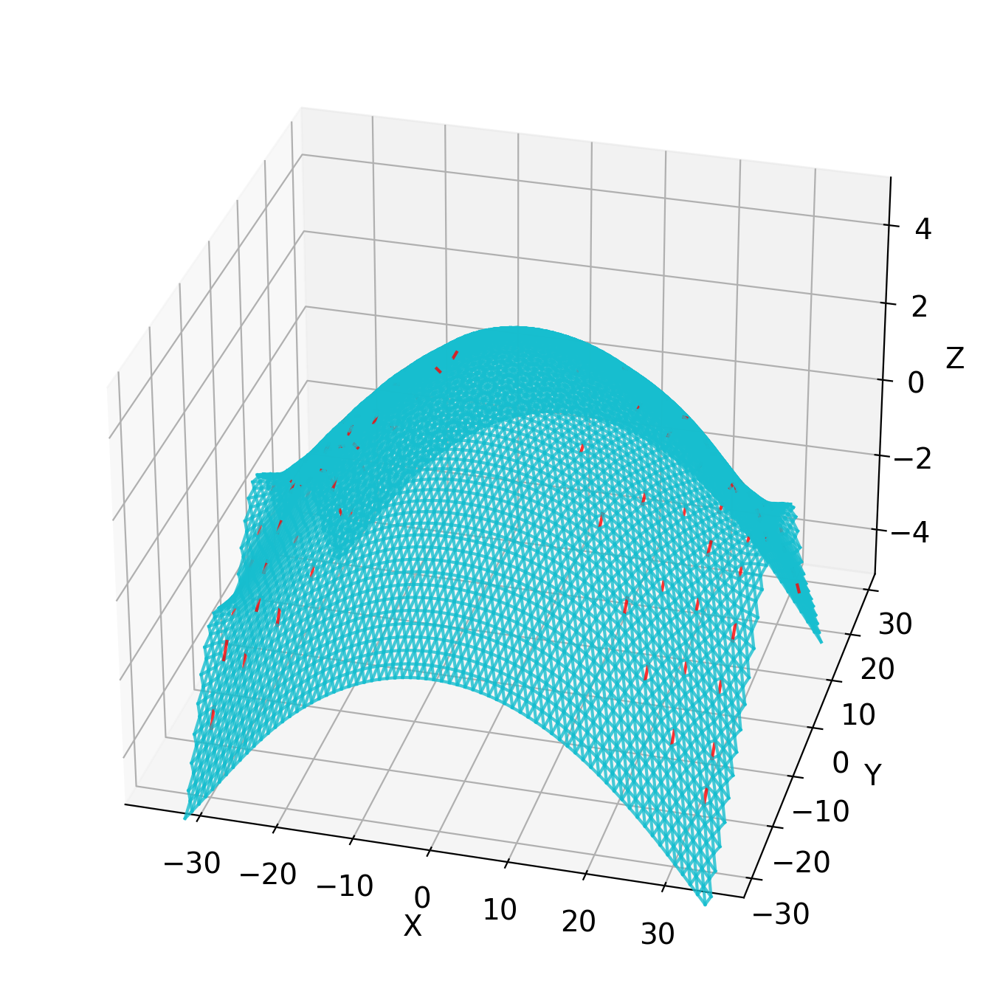

# Curvature design by defects

Simulating molecular dynamics using [HOOMD-blue](https://hoomd-blue.readthedocs.io/) 
to see how the distribution of defects on a lattice changes its Gaussian curvature.

<p style="text-align:center">


</p>

## Installation
To run the code, the following packages must be installed:
```
hoomd
gsd
```

Then, run the `setup.py` to install the other dependencies
```commandline
python setup.py
```

## Usage

### Creating the lattice
The class `TriangularLatticeGenerator` stores the data about the lattice before relaxation.
It is used to create `Lattice` objects that can undergo relaxation.
```python
from latticedefects import latticegenerator

nx, ny = 7, 7  # number of sites 
lattice_gen = latticegenerator.TriangularLatticeGenerator(nx, ny, dihedral_k=2.5, inclusion_d=1.2)

# Here we can set the parameters of the lattice, e.g. add defects at the desired sites
lattice_gen.add_inclusion_defect(3, 3)

# Place the masses on some initial spherical cap
lattice_gen.set_z_to_sphere()

lattice = lattice_gen.generate_lattice()

# Log the trajectory to file every 1000 timesteps 
lattice.log_trajectory('traj.gsd', 1000)

# Relax the masses
lattice.do_relaxation()
```

### Plotting the configuration
After the relaxation, we can either plot the relaxed configuration either
1) directly from the `Lattice` object
   ```python
   from matplotlib import pyplot as plt
   
   fig = plt.figure()
   ax = fig.add_subplot(111, projection='3d')
   
   lattice.plot_dots(ax)
   lattice.plot_bonds(ax)
   ```
2) by reading the output trajectory file:
   ```python
   from latticedefects import trajectory
   
   # The trajectory is a list of all the saved frames
   frames = trajectory.load_trajectory('traj.gsd')
   # The last frame should be the relaxed configuration
   relaxed_frame = frames[-1]
   relaxed_frame.plot_bonds(ax)
   ```

### Interactive plotting the trajectory file
Once we have a trajectory saved as .gsd file we can plot its data by the script
```shell
defectsplot --file FILE plot
```
